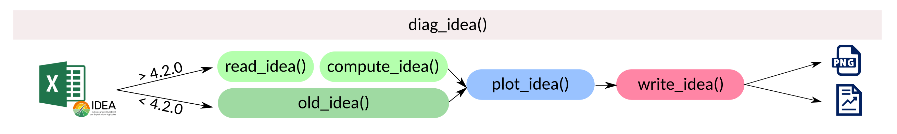
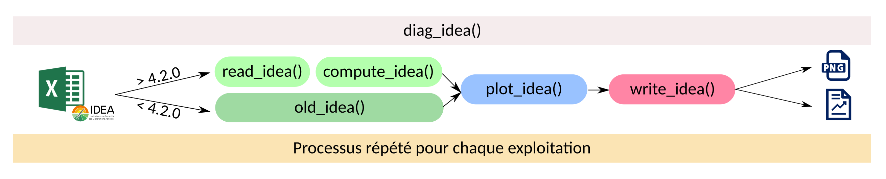
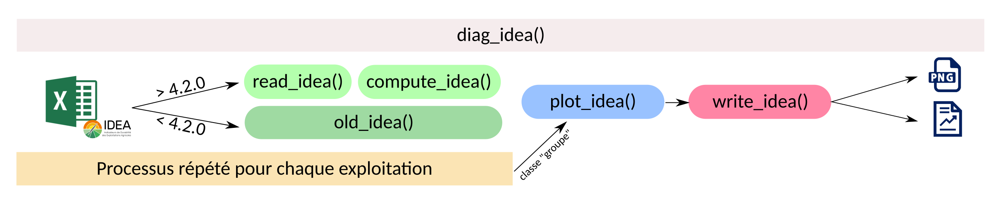
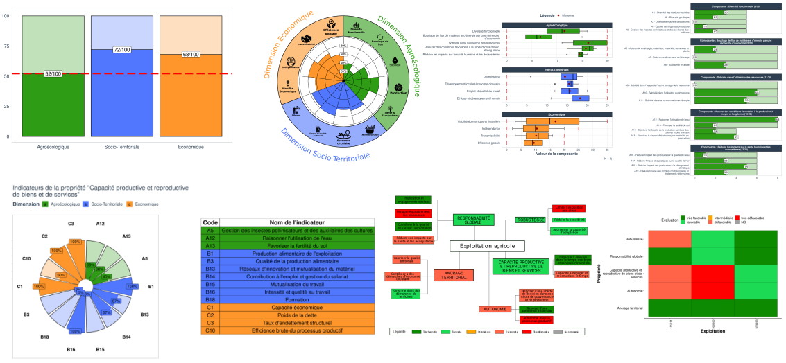
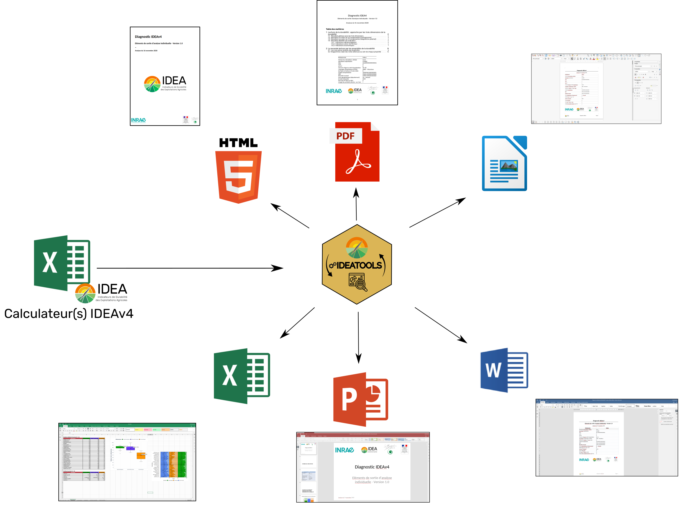

layout: true


```{r setup, include=FALSE}
options(htmltools.dir.version = FALSE)
knitr::opts_chunk$set(
	echo = FALSE,
	message = FALSE,
	warning = FALSE,
	eval= FALSE,
	dpi = 300,
	out.width = "80%",
	dev.args=list(bg="transparent")
)
library(InraeThemes)
library(ggplot2)
library(gt)
```


---
class: center, middle

# Raison d'être

---

# IDEATools, c'est quoi ?

.pull-left[
IDEATools est un package R, dont le développement a débuté en Octobre 2019 avec pour objectif de répondre aux besoins techniques apportés par le développement de la 4ème version de la méthode IDEA [1], soit :

- Des besoins techniques 

- Des besoins de rapidité

- Des besoins de fiabilité

- Des besoins de reproductibilité
]

.pull-right[
<center>

</center>
]

.footnote[
[1] https://idea.chlorofil.fr/idea-version-4.html
]

---

# Pourquoi une version 2 ?

- IDEATools 1.0 puis 1.1 sont issus d'un développement rapide, sur le tas, pour répondre au plus vite aux demandes du conseil scientifique de la méthode.

- Bien que fonctionnelles, ces versions souffraient d'un manque de logique entre les différents modules développés, d'un code trop peu (ou pas) commenté et de certaines instabilités liées aux différents systèmes d'exploitations.

- Le nouvel IDEATools 2.0 corrige ces erreur en s'inscrivant dans une logique d'intégration continue (Github Actions) qui vérifie en continu l'intégrité et l'inter-opérabilité du code au fil des modifications.

- Le nombre de lignes de codes nécessaires pour un utilisateur novice de R a été considérablement raccourci par la création d'une fonction englobante, `diag_idea()`

- Un site [pkgdown](https://davidcarayon.github.io/IDEATools/) dédié au package a été créé à cette occasion.


---
class: center, middle

# Utilisation

---

# Une fonction unique : `diag_idea`()

```r
diag_idea(input,
          output_directory,
          type = c("single","group"),
          export_type = c("report","local",NULL),
          plot_choices = c("dimensions","trees","radars"),
          report_format = c("pdf","html","docx","odt","pptx","xlsx"),
          prefix = "EA",
          dpi = 300,
          quiet = FALSE)
```

Permet :

- Production des graphiques et tableaux en objet R

- Sortie des graphiques en PNG/PDF

- Production de rapport automatiques

- Analyses (multi-)individuelles et/ou de groupe

---

# Comment ça marche ?

- 5 modules :

  - `read_idea()` : Permet d’identifier la validité du fichier d’entrée et d’en extraire métadonnées et items
  
  - `compute_idea()` : Calcule les indicateurs/composantes/dimensions/propriétés à partir des items
  
  - `old_idea()` : Alternative aux deux fonctions précédentes si le calculateur est trop ancien (vise les indicateurs plutôt que les items)
  
  - `plot_idea()` : Produit les graphiques dimensions / propriétés
  
  - `write_idea()` : Export des graphiques sous forme brute ou sous forme de rapports aux formats variés.


---

# Comment ça marche ?

- Programmation orientée objet typique de R type S3 :
  - Selon la classe des données d'entrée, les fonctions se comportent différemment


**Individuel** :
<center>

</center>

**Multi-individuel** :
<center>

</center>


---

# Comment ça marche ?


**Groupe** :
<center>

</center>

---


# Fonctionnalités internes

- Les règles de décisions utilisées pour l'approche par les propriétés sont librement consultables via la ligne de commande :

```r
IDEATools::show_decision_rules()
```

- Les modèles utilisés pour le tracé des arbres éclairés peuvent également être consultés via la ligne de commande :

```r
IDEATools::show_canvas()
```

Pour plus d'informations sur le fonctionnement du package, des vignettes ont été rédigées :

```r
vignette(package = "IDEATools")
```

---


# Exemples de sorties : Graphiques

<center>

</center>


---

# Exemples de sorties : Rapports

<center>

</center>

---
class: center, middle

# Exemples d'application

---


# Exemple 1 : Analyse individuelle

L’utilisateur peut avoir besoin d’un diagnostic pour une seule ferme. Prennons ici l’exemple d’un utilisateur qui souhaite récupérer des résultats pour sa ferme, mais uniquement ses arbres éclairés. Le code sera alors :

```r
diag_idea(input = "chemin_calculateur",
          output_directory = "mes_résultats",
          type = "single",
          export_type = "local"
          prefix = "MaFerme",
          plot_choices = "trees"
          quiet = FALSE)
```

---

# Exemple 2 : Analyse multi-individuelle

Certains utilisateurs ont besoin de traiter plusieurs calculateurs en même temps.

Ici par exemple, l’utilisateur n’a pas besoin des figures “brutes”, mais a juste besoin pour chaque exploitation d’un rapport au format word qu’il pourra commenter ainsi qu’une présentation powerpoint qu’il pourra facilement partager. Le code sera alors :

```r
diag_idea(input = "chemin_vers_dossier",
          output_directory = "mes_résultats",
          type = "single",
          export_type = "report",
          report_format = c("docx","pptx"),
          quiet = FALSE)

```

---

# Exemple 3 : Analyses de groupe

Certains utilisateurs souhaitent traiter un ensemble de calculateurs en même temps et ont besoin d’avoir une vision globale sur le groupe. Dans cet exemple, l’utilisateur va donc demander des graphiques bruts, mais aussi des rapports prêts à être imprimés (PDF) ainsi qu’un support excel qu’il pourra re-traiter à sa guise pour son analyse de groupe. Le code sera alors :


```r
diag_idea(input = "chemin_vers_dossier",
          output_directory = "mes_résultats",
          type = "group",
          export_type = c("report","local")
          report_format = c("pdf","xlsx")
          quiet = FALSE)
```
---

# Exemple 3 : Analyses de groupe

Notons qu’il peut demander, en plus de son analyse de groupe, des rapports individuels qu’il pourra donner à chaque exploitation (par exemple au format Libreoffice ODT) :

```r
diag_idea(input = "chemin_vers_dossier",
          output_directory = "mes_résultats",
          type = c("group","single")
          export_type = c("report")
          report_format = c("odt")
          quiet = FALSE)
```

**Note : Une analyse de groupe nécessite un nombre d’exploitations au moins égal à 3.**


---
class: center, middle

# Merci de votre attention !

Pour plus d'informations :

**[david.carayon@inrae.fr](mailto:david.carayon@inrae.fr)**

**[https://github.com/davidcarayon/IDEATools](https://github.com/davidcarayon/IDEATools)**

