layout: true

```{r setup, include=FALSE}
options(htmltools.dir.version = FALSE)
knitr::opts_chunk$set(
	echo = FALSE,
	message = FALSE,
	warning = FALSE,
	dpi = 300,
	out.width = "80%",
	dev.args=list(bg="transparent")
)
library(InraeThemes)
library(ggplot2)
library(gt)
```


---
class: center, middle

# Introduction

---

# Qu'est ce qu'IDEA ?


<center>
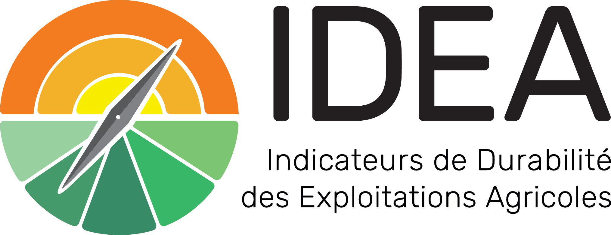
</center>

- Méthode permettant d'évaluer la performance globale d'une exploitation agricole dans le temps via une approche pédagogique.

- Aide au diagnostic/pilotage et propose des pistes concrètes d'amélioration


---


# Une nouvelle version d'IDEA ... 


IDEA V4 introduit un tout nouveau cadre conceptuel, proposant 53 indicateurs permettant d'analyser la durabilité d'une exploitation agricole selon deux approches complémentaires.


<center>
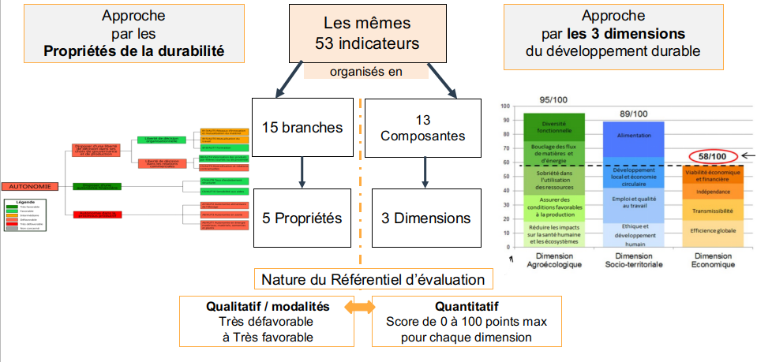
</center>


---

# ... Qui demande des nouveaux outils


.pull-left[


- 107 items, 53 indicateurs, 13 composantes, 3 dimensions, 15 branches...


- Tables de conversion, calcul du bilan apparent, données comptables...

]

--

.pull-right[
<p style='color:red'> - Besoin d'outils informatiques automatisés !</p>
<center>

</center>
]

---

class: center, middle

# Quels outils informatiques ?

---

# Approche par les dimensions (Principes)

- Approche basée sur du scoring, sommes plafonnées

<center>

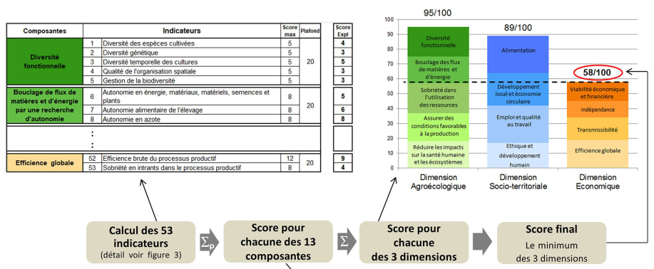

</center>

---

## Approche par les dimensions (Solutions)

- Développement d'un calculateur sous Excel

<center>

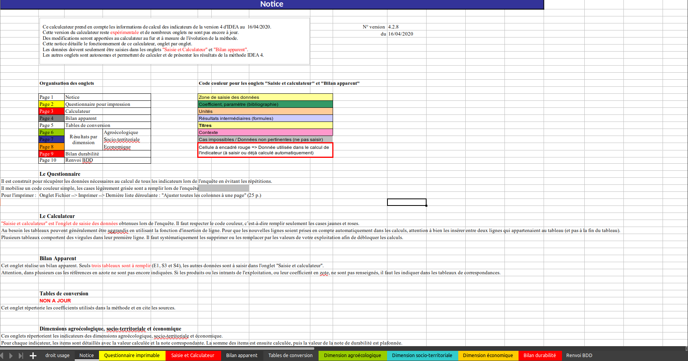

</center>

---


.pull-left[
- Avantages du calculateur excel :
  - Regroupe la saisie et la restitution des résultats
  - Ne dépend pas d'une connexion internet
  ]
  
--
  
.pull-right[
- Inconvénients : 
  - Logiciel propriétaire
  - Capacités limitées pour la restitution graphique
  - Entrée utilisateur "hasardeuse"
  
]

  <center>

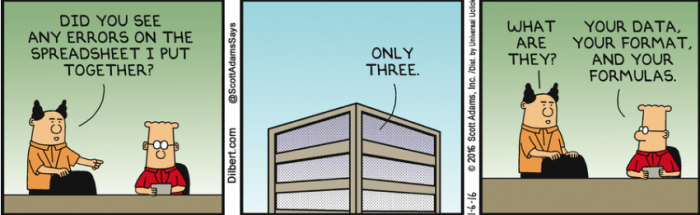

</center>
  
---

# Approche par les propriétés (Principes)

- Approche basée sur de l'agrégation qualitative hiérarchique (branches, noeuds, sous-noeuds...)

<center>

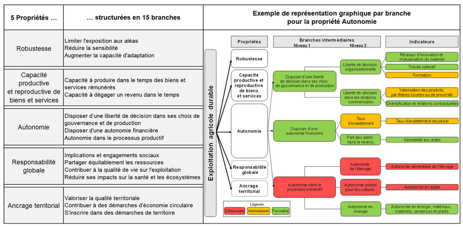

</center>

---

# Approche par les propriétés (Solutions)

.pull-left[
Ancienne procédure :
- Remplir le calculateur excel *Dimensions*
- Recopie manuelle vers DEXi
- Travail dans DEXi
- Recopie manuelle dans un **nouveau** calculateur excel
- Coloration **manuelle** des cases
]

--

.pull-right[
- En cas d'erreur... On recommence !

<center>


</center>


]


---

# Etat des lieux au 01/10/2019

### - Besoins techniques : Approche par les propriétés
  

### - Besoins de fiabilité : Automatisation des processus


### - Besoins de rapidité : Traitement de 20, 50, 100 exploitations


### - Besoins de représentations : Visualisations modernes

---

class: center, middle

# IDEATools

<center>


</center>

---

# IDEATools, qu'est ce que c'est ?

> *IDEATools est un ensemble de scripts programmés sous **R**, rassemblés sous forme de **package**, mettant à disposition une collection d'outils et de règles de décisions pour le calcul, l'automatisation et le reporting de données IDEA V4.*
<br>
Carayon et al., 2020.

---

# Pourquoi une technologie R ? 

<center>

</center>

- R est open source : c’est un programme libre et gratuit.
- R est référant : c’est un logiciel beaucoup utilisé par les universitaires mais aussi dans le privé ou le milieu industriel.
- R est un langage de programmation : le travail repose sur des scripts, des algorithmes, ce qui permet une automatisation efficace et garantit la reproductibilité des résultats.

---

- ... Et on fait avec ce qu'on maîtrise !

<center>

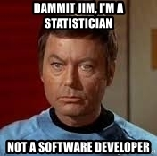

</center>

---

class: center, middle

# Les 3 objectifs d'IDEATools

---

# 1.1 Remplacer DEXi pour l'approche par les propriétés

- Traduction des règles de décision construites sous DEXi (= 48 tables) sous forme de `data.frame` dans R

Exemple (extrait): 

.small[
```{r, echo = FALSE}
knitr::kable(IDEATools:::decision_rules_total$node_1)
```
]

---

# 1.2 Production des arbres éclairés

<center>

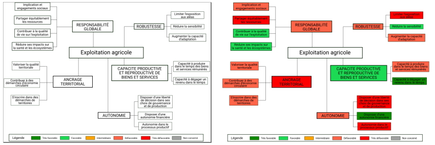

</center>

- Tracé de modèles "blanc" à la main
- Algorithmes à base de "Rechercher/remplacer" pour modifier le code source du modèle en fonction des données

---

# 2. Production de nouveaux graphiques

<center>


</center>

---

# 3. Vers des solutions de reporting

.pull-left[
- Compilation des résultats
- 6 formats possibles
- Certains destinés à l'impression, d'autres à la modification
- Durée : ~25s par analyse complète (dimensions + propriétés)
- Documents de ~6Mb
]

.pull-right[
<center>

</center>
]

---

# Exemple de diagnostic

```r

library(IDEATools)

diag_idea(input,
          output_directory,
          type = c("single","group"),
          export_type = c("report","local",NULL),
          plot_choices = c("dimensions","trees","radars"),
          report_format = c("pdf","html","docx","odt","pptx","xlsx"),
          prefix = "EA",
          dpi = 300,
          quiet = FALSE)

```

---

# Bilan

.pull-left[
- IDEATools 2.0 fonctionnel (quelques améliorations à prévoir)
- Package publié sous licence GPL 3 sur [Github](https://github.com/davidcarayon/IDEATools)

- Site web dédié : [https://davidcarayon.github.io/IDEATools/](https://davidcarayon.github.io/IDEATools/)
]

.pull-right[
<center>
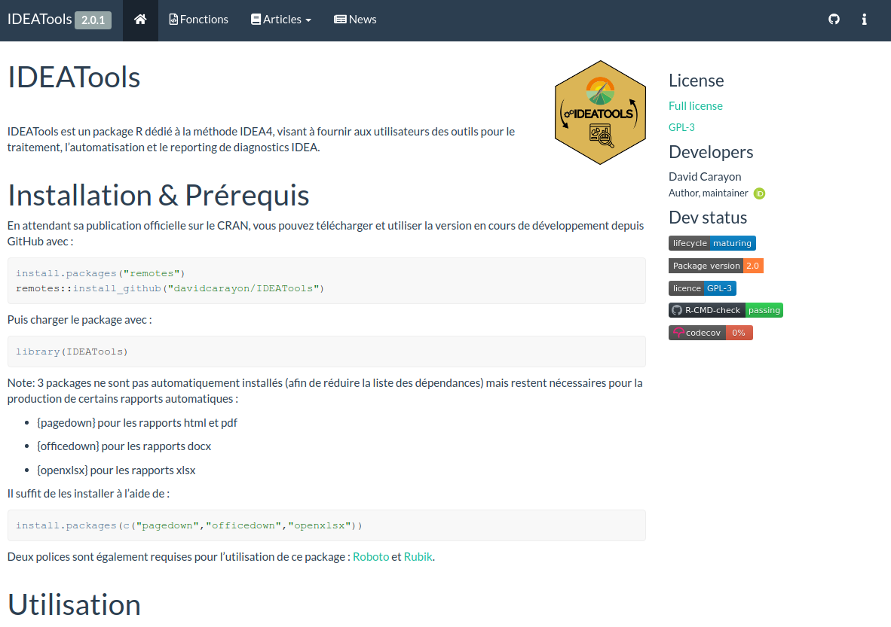
</center>
]

--

---

# Sauf que...

- Bien qu'il soit fonctionnel, il reste reservé aux utilisateurs de R...

--

<center>

</center>

---

class: center, middle

# ShinyIDEA

---

# Shiny, c'est quoi ?

<center>
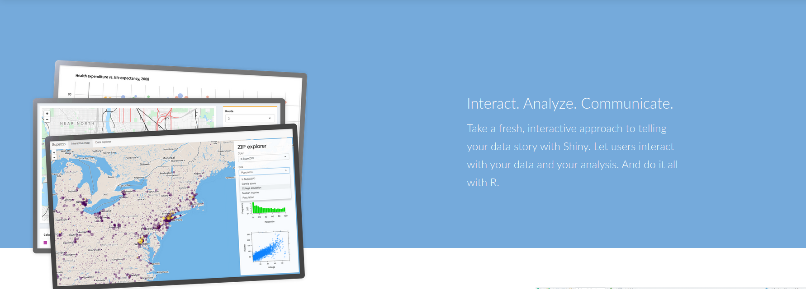
</center>

- Shiny est un package permettant le développement d'applications interactives pour le web tout en profitant de la puissance calculatoire et des nombreuses librairies graphiques de R. 
- Idéal pour la valorisation de résultats de la rercherche / d'outils R
- Possibilité d'intégrer des langages de programation WEB (HTML/CSS/JS) dans du code R

---

# ShinyIDEA

- [https://outils-idea.inrae.fr/](https://outils-idea.inrae.fr/) (Work in Progress...)

<center>
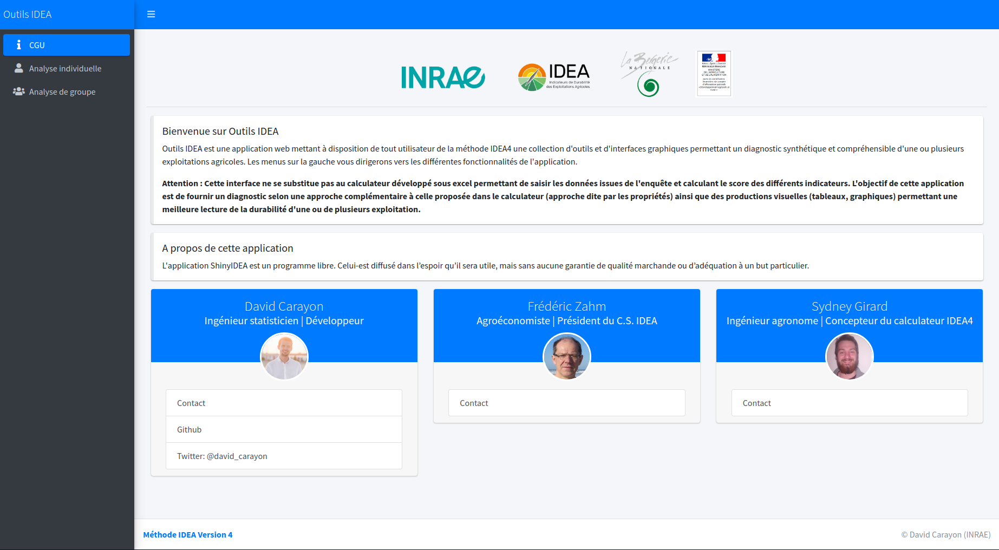
</center>

---

# Analyse individuelle

<center>
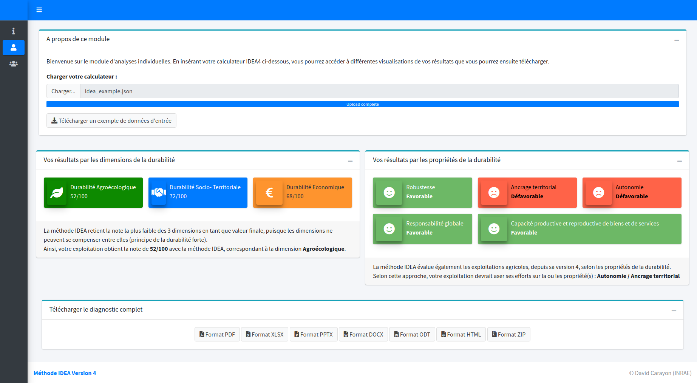
</center>

---

# Analyse de groupe

<center>
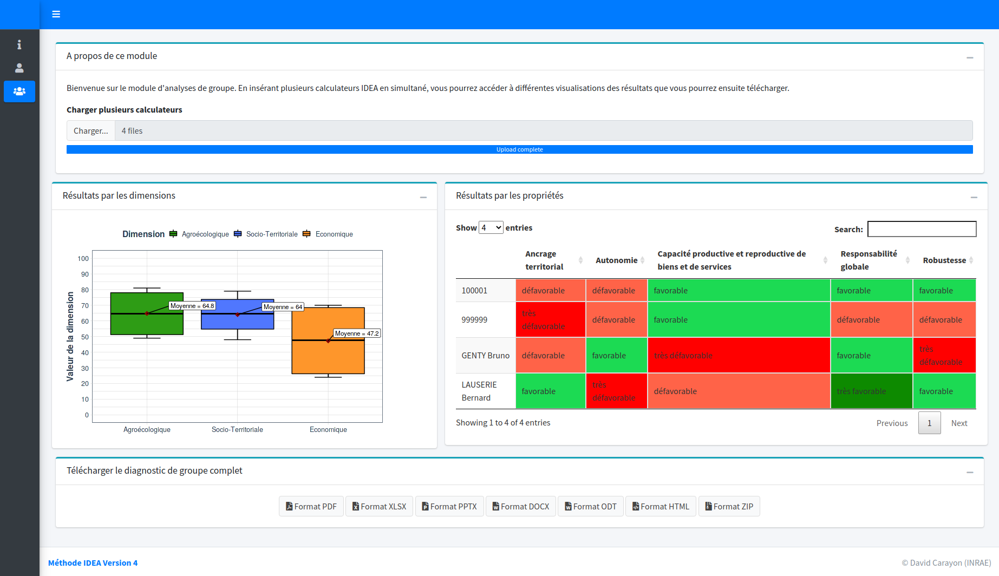
</center>

---

# Démonstration

<center>


</center>

